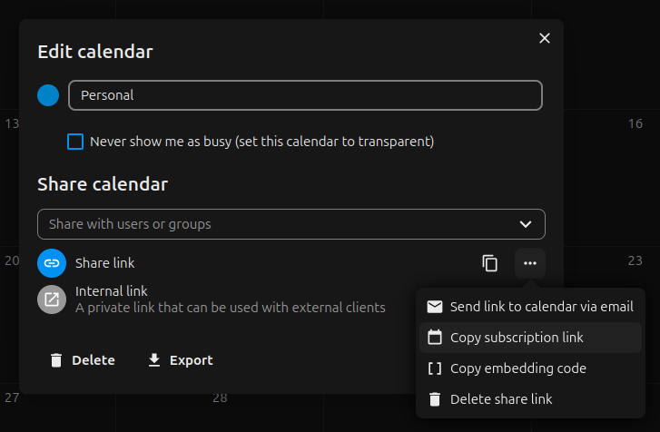

# SilverBullet iCalendar Plug

`silverbullet-icalendar` is a [Plug](https://silverbullet.md/Plugs) for [SilverBullet](https://silverbullet.md/) which I made for my girlfriend.
It reads external [iCalendar](https://en.wikipedia.org/wiki/ICalendar) data, also known as iCal and `.ics` format, used in CalDAV protocol.

## Installation

Run the {[Plugs: Add]} command in SilverBullet and add paste this URI into the dialog box:

```
ghr:Maarrk/silverbullet-icalendar
```

Then run the {[Plugs: Update]} command and off you go!

### Configuration

This plug is configured with [Space Config](https://silverbullet.md/Space%20Config), short example:

```yaml
icalendar:
  # where to get the iCalendar data from
  sources:
  - url: https://example.com/calendar.ics
    # this will be set as sourceName on all results from this source
    name: Example calendar
```

Instructions to get the source URL for some calendar services:

- Nextcloud ([source](https://help.nextcloud.com/t/how-to-access-the-calendar-ics-file-via-url/7880)):
  - Edit calendar (pencil icon to the right of the name)
  - Share calendar link
  - Details (three dots icon), copy subscription link
  - Verify that the link ends with `?export`
- Google Calendar ([source](https://support.google.com/calendar/answer/37648?hl=en#zippy=%2Cget-your-calendar-view-only)): 
  - Calendar settings (pencil icon to the right of the name)
  - Settings and Sharing, scroll down to Integrate calendar
  - Copy the link for Secret address in iCal format



## Usage

The plug provides the query source `ical-event`, which corresponds to `VEVENT` object

### Examples

Select events that start on a given date

~~~
```query
ical-event
where start =~ /^2024-01-04/
select summary, description
```
~~~

## Roadmap

- Cache the calendar according to `REFRESH-INTERVAL` or `X-PUBLISHED-TTL`, command for manual update
- More query sources:
  - `ical-todo` for `VTODO` components
  - `ical-calendar` showing information about configured calendars
- Describe the properties of query results
- Support `file://` URL scheme (use an external script or filesystem instead of authentication on CalDAV)

## Contributing

Pull requests with short instructions for various calendar services are welcome.
If you find bugs, report them on the [issue tracker on GitHub](https://github.com/Maarrk/silverbullet-icalendar/issues).

### Building from source

To build this plug, make sure you have [SilverBullet installed](https://silverbullet.md/Install). Then, build the plug with:

```shell
deno task build
```

Or to watch for changes and rebuild automatically

```shell
deno task watch
```

Then, copy the resulting `.plug.js` file into your space's `_plug` folder. Or build and copy in one command:

```shell
deno task build && cp *.plug.js /my/space/_plug/
```

SilverBullet will automatically sync and load the new version of the plug (or speed up this process by running the {[Sync: Now]} command).

## License

MIT, following SilverBullet
